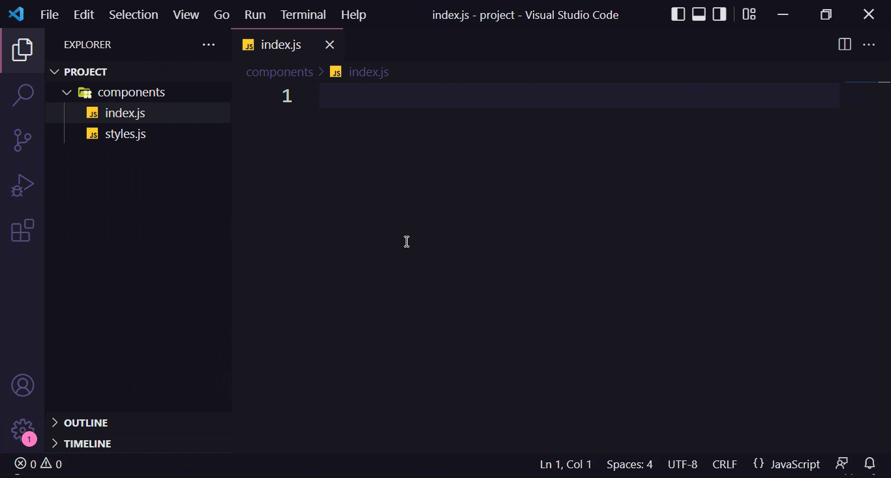

<!--
*** Thank you to see this README. 
*** If you have a suggestion that can improve it more than a
*** fork and create a Pull Request or open an Issue with a "suggestion" tag.
*** Thank you a lot!
-->

<h1 align="center">
  
</h1>

 

<h1 align="center">
  
</h1>

## About
This extension makes available a set of Snippets to create components for React Native applications.

## Getting started

Open any file with Visual Studio Code, and type `rnbc` and press `Tab` keyboard to create a new React Native Basic Component.
You can too create a new with Stylesheet to custom our React Native Interfaces typing inside your file `rnso` and press `Tab` keyboard to create.

### Snippets

List of available Snippets. Or **⇥** means the `TAB` key.

|                    Snippet | Content                                                                       |
| -------------------------: | ----------------------------------------------------------------------------- |
|                    `rnbc →` | Create a new **React Native Basic Component**                                |
|                    `rnso →` | Create a new **React Native Stylesheet Component**                           |
|                    `rnsc →` | Create a new **React Native Component with Styled Component**                           |
|                    `rnscs →` | Create a new **Styled Component File**                           |
|                    `rnsctc →` | Get the path to **color theme props**                           |
|                    `rnsctf →` | Get the path to **fonts theme props**                           |
|                    `nbc →` | Create **Native Base** Component                           |

## Contribution
Any contribution you make will be **much appreciated**.

#### Find me elsewhere

 

